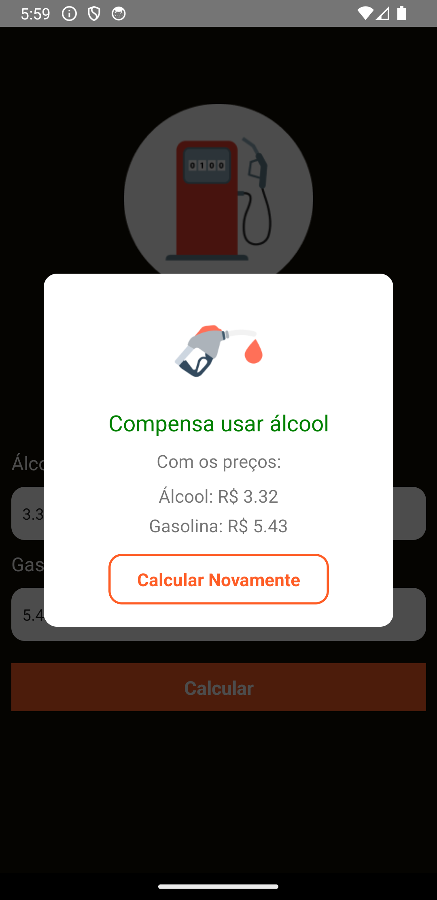

# Fuel Calculator App

## Purpose

- The Fuel Calculator App is a React Native mobile application designed to help users determine whether it's more economical to use ethanol (alcohol) or gasoline as fuel for their vehicles. The app calculates the fuel's cost-effectiveness based on user-provided prices per liter for both ethanol and gasoline.

The primary features of this app include:

- Entering prices for ethanol and gasoline.
- Calculating the cost-effectiveness of using either fuel.
- Displaying a recommendation based on the calculated result.
- Providing an option to recalculate.
- This app is a practical tool for individuals looking to make informed decisions when filling up their vehicles with fuel.

## Fuel Calculator App Preview

### Screenshot:

  
  <br>
  <br>
  
  <br>
  <br>
  
  <br>

## Technologies Used

- React Native
- CLI
- React Native Modal

## How to Use

### Clone the repository to your local machine:

```bash
git clone git@github.com:FranciscoVieir/FuelCalculator-App.git
```

### Access the folder

```bash
cd gasStationCalculator
```

## Install dependencies:

```bash
npm install
```

#### or

```bash
yarn start
```

## Availble Scripts

In the project, directory, you can run the following scripts:

- npm run start or yarn start: Starts the CLI development server.
- npm run android or yarn android: Runs the app on an Android emulator/simulator.
- npm run ios or yarn ios: Runs the app on an iOS simulator.
- npm run eject or yarn eject: Ejects the app from CLI, if needed.
